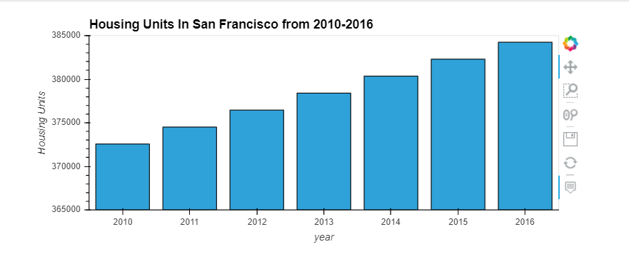
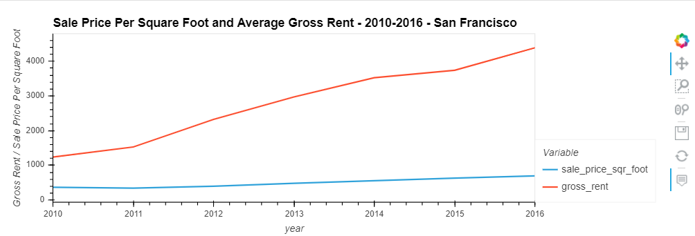
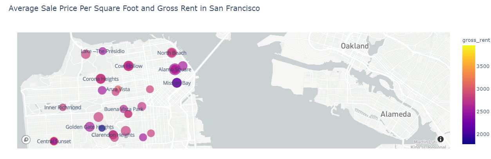

# Housing Rental Analysis For San Francisco

This is a Jupyter Notebook that uses Pandas hvplot and Mapbox API to bring interactive visualization along with Geo-Maps.  In this particular instance, we're using a set data from the San Francisco real estate market years between 2010 - 2016.  The notebook is configured plot the geo coordinates from Mapbox, you will need to update and rename file sample.env to .env so the KEY=Value pair may authenticate at Mapbox (sign up and register for free).  Explore, discover and have fun using this notebook.

---


## Technologies

This project leverages python 3.7 with the following packages:

* [Pandas](https://pandas.pydata.org/docs/user_guide/visualization.html) - For the command line interface, help page, and entrypoint.

* [JupyterLab](http://jupyterlab.io/) - For interactive user workspace that utilizes Notebook.

* [matplotlib](https://plotly.com/python/px-arguments/) - Plotly Express Arguments in Python.

* [Mapbox](https://account.mapbox.com/auth/signup/) - sign up and register.

* [dotenv](https://www.npmjs.com/package/dotenv)- loads environment variables from a .env file into process.env.

---

## Installation Guide

Before running the application first install the following dependencies in your designated environment.


* [Git Bash (Windows) or Terminal (macOS)] (https://git-scm.com/downloads) -  
* [Anaconda with Python 3.7] (https://docs.anaconda.com/anaconda/install/) - 

* [installing the Requests library] (conda install -c anaconda requests)

* [installing the JSON library] (conda install -c jmcmurray json)
* [installing python-dotenv Library] (pip install python-dotenv)
* [install PyViz] 
    - conda install -c plotly plotly=4.13.
	- conda install -c pyviz hvplot
* [Install the JupyterLab Extensions]
    - jupyter labextension install jupyterlab-plotly@4.13.0
	- jupyter labextension install jupyterlab-plotly@4.13.0
	- jupyter labextension install @pyviz/jupyterlab_pyviz
	- jupyter lab build

--- 

You’ll use environment (.env) files to protect your Quandl and Alpaca API keys. When you create an environment file, the system hides it in the folder structure of the project. 
Windows Users: Display Your Hidden Files in File Explorer
To display the hidden files on a Windows computer, complete the following steps:

In the search bar, type “folder”.

Click “File Explorer Options”.

In the “File Explorer Options” dialog box that displays, click the View tab. Select “Show hidden files, folders, and drives,” and then click OK, as the following image shows:

---

## Examples

This section includes screenshots of few plots that can easyly be obtain by running this notebook.

- Plotting a bar chart illustrating Housing Units in San Francisco.

- Plotting a line chart illustrating Sale PPSF and Aver. Gross Rent.

- Plotting a map chart using same date use in the line chart above.


---

## Usage

To use HousingRentalAnalysisForSanFrancisco book simply clone the repository and run "Git Bash" with:

```
- Start by activating an Anaconda Environment instance.
- Then follow by starting Jupyter Lab

```
Upon launching the loan qualifier application you will be greeted with the following prompts.


---

## Contributors

Brought to you by Carlos R. you may reach me at reachcarlostoday@gmail.com

---

## License

MIT.